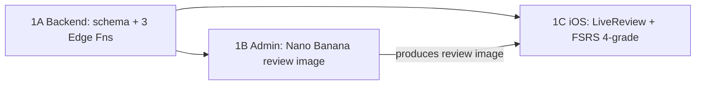

# Implementation Plan — Live Voice Review Agent

**Companion to:** [001-live-voice-review-agent.md](001-live-voice-review-agent.md) (the "why" + decisions).
This doc is the "how": concrete, sequenced, per-repo tasks with file paths, schemas,
signatures, and acceptance criteria. **Phase 0 + 1 are detailed; Phases 2–4 are
outlines.**

---

## 0. Prerequisites & conventions

### Repo layout (all three are git submodules under `aretay-mono/`)
- `aretay-ios/` — SwiftUI app, Swift 6, iOS 17+. Session code in
  `aretay-ios/Aretay/Features/Session/`, services in `aretay-ios/Aretay/Services/`.
- `aretay-backend/` — Supabase. Migrations in `aretay-backend/supabase/migrations/`,
  Edge Functions in `aretay-backend/supabase/functions/`. Managed via
  `aretay-backend/run-backend.sh`.
- `aretay-admin/` — Next.js 16 studio. Routes in `aretay-admin/app/api/`, libs in
  `aretay-admin/lib/`.

### Existing patterns to follow (don't reinvent)
- **PostgREST calls:** `aretay-ios/Aretay/Services/StudyAPI.swift` (direct
  `URLSession`, `apikey` + bearer, custom date coding). New API calls mirror this.
- **Edge Function:** `aretay-backend/supabase/functions/delete-account/index.ts` is
  the reference for a JWT-authed Deno function.
- **FSRS scheduler:** `aretay-ios/Aretay/Services/FSRS.swift` — the math already
  generalizes over rating value; only the `switch rating` arms are binary today.
- **Image generation:** `generateImage` / `IMAGE_MODEL` in
  `aretay-admin/lib/llm.ts`, called from
  `aretay-admin/app/api/generate-board/route.ts`.
- **Card production metadata:** read/write via `getCardProduction` /
  `mergeCardProduction` in `aretay-admin/lib/cards.ts`.

### Assumptions to validate in Phase 0
- `gemini-3.1-flash-live-preview` Live API exists with bidirectional audio +
  function calling, and `gemini-3.1-flash-image-preview` (Nano Banana 2) is
  reachable via OpenRouter.
- Gemini Live supports **ephemeral tokens** (else fall back to a proxy relay — RFC §6.2).
- Audio formats (expect PCM16, 16 kHz in / 24 kHz out — confirm in spike).

---

## Phase 0 — Gemini Live spike (de-risk)

**Goal:** prove the live loop end-to-end with throwaway code and *measure* it.
No real data, no backend, no schema. Done on a branch in `aretay-ios`.

### Tasks
1. **Audio I/O.** Configure `AVAudioSession` (`.playAndRecord`, `.voiceChat`, echo
   cancellation) and an `AVAudioEngine` tap that emits **PCM16 mono** frames;
   playback path for model audio.
2. **WS client.** Connect (`URLSessionWebSocketTask`) to the Gemini Live endpoint
   using a **local dev API key** (hardcoded for the spike only — never shipped).
   Model id from a local constant.
3. **Session config.** Send a setup message with:
   - a system instruction containing **2–3 hardcoded cards** (question + canonical
     answer) plus the generic grading instruction + integrity rules from RFC §9.3;
   - **function declarations** for `grade_card`, `next_card`, `end_session` matching
     the schema in RFC §6.5 / §9.1.
4. **Tool handling.** Parse function-call events; print the structured `grade_card`
   payload and the result of the `assessment → FSRS` mapping (RFC §9.2) to the
   console; send a function-response back so the model continues.
5. **Barge-in.** Confirm talking over the model interrupts its audio.
6. **Measure.** Log (a) latency from end-of-user-speech to first model audio, and
   (b) token/session cost for a ~2-minute run, on a real device over cellular.

### Acceptance criteria
- [ ] Agent greets, asks 3 hardcoded questions, and the human can answer by voice.
- [ ] Barge-in interrupts mid-utterance.
- [ ] Each answer triggers a `grade_card` function-call with a parseable
      `assessment`/`fluency`/`hint_used`; the console prints the mapped FSRS rating.
- [ ] `end_session` fires after the last card.
- [ ] Latency and cost numbers recorded in the spike notes.

### Outputs that feed Phase 1
Confirmed: model id, audio sample rates/encoding, WS message framing, the exact
function-declaration JSON shape, and whether ephemeral tokens are available.

---

## Phase 1 — End-to-end wire-up (behind a per-user flag)

Three workstreams. **Backend first** (others depend on its contracts), then Admin
and iOS in parallel.



### 1A — Backend (`aretay-backend`)

#### Migration
Create with `./aretay-backend/run-backend.sh new live_voice_review`, then author:

```sql
-- review_sessions: owner of the end-of-session report (RFC §7.2)
create table public.review_sessions (
  id         uuid primary key default gen_random_uuid(),
  user_id    uuid not null references auth.users(id) on delete cascade,
  course_id  uuid references public.courses(id) on delete set null,
  mode       text not null default 'voice' check (mode in ('voice','mc')),
  scheduler  text not null,
  status     text not null default 'active' check (status in ('active','completed','abandoned')),
  started_at timestamptz not null default now(),
  ended_at   timestamptz,
  card_count int not null default 0,
  report     jsonb,
  created_at timestamptz not null default now()
);
create index review_sessions_user_idx on public.review_sessions(user_id, started_at desc);
alter table public.review_sessions enable row level security;
create policy "users manage own review sessions" on public.review_sessions
  for all to authenticated using (user_id = auth.uid()) with check (user_id = auth.uid());

-- review_logs: extend for voice grading (RFC §7.3)
alter table public.review_logs
  add column session_id        uuid references public.review_sessions(id) on delete set null,
  add column source            text not null default 'mc' check (source in ('mc','voice')),
  add column answer_transcript text,
  add column assessment        text check (assessment in ('correct','partial','incorrect','skipped')),
  add column agent_rationale   text;

-- CRITICAL: today review_logs.rating has check (rating in (1,3)). 4-grade fsrs5
-- needs Hard(2)/Easy(4). Replace the constraint (existing rows stay valid).
alter table public.review_logs drop constraint review_logs_rating_check;
alter table public.review_logs add constraint review_logs_rating_check check (rating in (1,2,3,4));
```

- `card_states` needs **no schema change** — `scheduler` is free text
  (`aretay-backend/supabase/migrations/20260609181000_spaced_repetition.sql` line 70).
  Voice sessions stamp the new `'fsrs5'` value.
- *(Optional)* `course_enrollments.review_mode text` for per-user rollout, else gate
  client-side.

#### Edge Functions (in `aretay-backend/supabase/functions/`, mirror `delete-account`)
1. **`start-review-session`** — verify JWT; load the user's **due** question cards
   for the course (state `<>` filters per the existing due query), each with
   `question`, `answer`, and the review image key; insert a `review_sessions` row
   (`status='active'`, `scheduler='fsrs5'`); mint an **ephemeral Gemini Live token**;
   return `{ sessionId, token, model, manifest: [{cardId, question, answer, imageR2Key}] }`.
2. **`submit-grade`** — verify JWT; validate the card is due and owned by the user;
   persist the **review_logs** row (`source='voice'`, `session_id`, `assessment`,
   `answer_transcript`, `agent_rationale`, mapped `rating`) and **upsert card_states**
   with the device-computed FSRS state. (Centralizing the write here is the trust
   boundary — RFC §7.6.)
3. **`finish-review-session`** — set `status='completed'`, `ended_at`, store `report`.

#### Secrets & deploy
- Add `GEMINI_API_KEY` + `GEMINI_LIVE_MODEL` as function secrets.
- Migrations auto-deploy on merge to `main`
  (`.github/workflows/deploy-migrations.yml`). Functions deploy via
  `supabase functions deploy <name>` — add a `deploy-fn` verb to `run-backend.sh`.

#### Acceptance
- [ ] Migration applies locally (`run-backend.sh start`) and a `review_logs` insert
      with `rating=2` and `rating=4` succeeds.
- [ ] `start-review-session` returns a manifest + token for a seeded due-card course.
- [ ] `submit-grade` rejects a card that isn't due for the caller (RLS + validation).

### 1B — Admin (`aretay-admin`)

1. **`lib/llm.ts`** — add `NANO_BANANA_MODEL = "google/gemini-3.1-flash-image-preview"`;
   extend `generateImage(prompt, { referenceImageUrl })` to pass the parent board /
   course cover as a style reference (OpenRouter `image_url` input).
2. **`lib/production.ts`** — extend `ProductionData` with `review_image_prompt?: string`
   and `review_image_r2_key?: string`; keep `alt_answers` (legacy/MC fallback). Add
   `buildReviewImagePrompt(question, boardTiles)`. **No `grading`/rubric field** —
   grading is generic against the canonical answer. Remove `MIN_QUESTION_VIDEO_SECONDS`
   / `buildQuestionVideoPromptPrompt` usage.
3. **New route `app/api/generate-review-asset/route.ts`** (replaces
   `generate-question-video`): image-prompt LLM call → `mergeCardProduction({review_image_prompt})`;
   Nano Banana image rendered from that prompt (reference = parent `board_r2_key` or
   cover) → `uploadObject` → `mergeCardProduction({review_image_r2_key})`. Accepts an
   `imagePrompt` override so an edited prompt re-renders. Drop the
   Kokoro/Seedance/video-prompt stages entirely.
4. **`lib/r2.ts`** — add a `reviewImageKey(courseId, questionKey)` helper
   (e.g. `…/segments/{questionKey}-review.png`).
5. **`lib/bulk-job.ts`** — `produceQuestion` (lines ~208–223) calls
   `generate-review-asset` (no Seedance retry loop); `buildPlan` question filter
   (lines ~132–134) changes from `!…video_r2_key` to "needs a review image"
   (`!…review_image_r2_key`).
6. **`app/courses/[id]/page.tsx`** — question cards drop the video stage
   bar/preview; show question → answer, the **image preview**, and an **editable
   image prompt** (re-renders the still); update the Generate-all cost popup (remove
   question-video line; alt-answers → "review image + image prompt"). *(The "test
   grade" sandbox is Phase 2.)*

#### Acceptance
- [ ] Running `generate-review-asset` on one question writes
      `metadata.production.review_image_prompt` + `review_image_r2_key`; image renders in style.
- [ ] `Generate all` on a test course produces a review image for every question,
      no Seedance calls, and the cost popup reflects the new lines.

### 1C — iOS (`aretay-ios`)

#### Models & FSRS
1. **`Services/FSRS.swift`** — extend the rating enum and wire the two new arms
   (the formulas already use `rating.rawValue`, so only the `switch` statements
   change):

```swift
enum FSRSRating: Int, Sendable {
    case again = 1
    case hard  = 2
    case good  = 3
    case easy  = 4
}
```

   In `review(...)`, `.review` state: `again` → forget/relearning (today),
   `hard`/`good`/`easy` → recall/graduate (Hard uses a smaller stability growth, Easy
   a bonus); `.new`/`.learning`/`.relearning`: `hard` steps or graduates per FSRS-5.
   Add `static let voiceSchedulerID = "fsrs5"` (keep `schedulerID = "fsrs5-binary"`
   for the MC path).
2. **`Models/Study.swift`** — add an insert payload for voice logs (or extend
   `ReviewLogInsert`) carrying `sessionId`, `source`, `assessment`,
   `answerTranscript`, `agentRationale`; `CardState.newCard` takes the scheduler id.
3. **`Models/Card.swift`** — decode `review_image_r2_key` from production metadata;
   expose `reviewImageURL` (via `MediaConfig`, like `videoURL`).

#### Networking
4. **`Services/StudyAPI.swift`** — add three `functions/v1/...` POST helpers
   (`startReviewSession(courseId:)`, `submitGrade(...)`, `finishReviewSession(...)`)
   following the existing request plumbing (bearer + `apikey`), pointed at the
   functions base URL.

#### Live review feature (new files in `Features/Session/`)
5. **`LiveReviewClient.swift`** — productionized Phase 0 spike: WS to Gemini Live
   (token from `startReviewSession`), `AVAudioEngine` capture/playback, function-call
   parsing for `grade_card`/`next_card`/`end_session`, published transcript + talk
   state.
6. **`LiveReviewController.swift`** (`@MainActor @Observable`) — owns the client,
   holds the due-review queue + per-card images, maps `assessment → FSRSRating`
   (RFC §9.2), runs `FSRSScheduler`, persists via `submitGrade`, advances the image
   surface, and calls `finishReviewSession` with the report. **This is the grader;
   `SessionEngine` no longer decides correctness for voice reviews.**
7. **`LiveReviewPageView.swift`** — `AsyncImage` still surface (cross-faded on
   `next_card`) + voice UI overlay (talk indicator, live transcript, mute/push-to-talk,
   close ✕, progress) reusing the chrome in
   `aretay-ios/Aretay/Features/Session/SessionView.swift`.

#### Integration seam
8. **`SessionView.swift`** — add `reviewMode: .multipleChoice | .liveVoice` to
   `SessionFeedPolicy`. When `.liveVoice`, the **review-question block** is presented
   via `LiveReviewController` / `LiveReviewPageView` instead of the per-page
   `QuestionPageView`; segment-teaching pages (`SegmentPageView`) and transitions are
   unchanged. `SessionEngine` exposes its due-review `QuestionItem`s to seed the
   controller; the existing `answerCurrentQuestion` MC path stays for fallback.

#### Acceptance
- [ ] With the flag on, starting a session with due reviews launches Live Review:
      agent asks, user answers by voice, images swap per card.
- [ ] Grades persist: `card_states` updated (scheduler `fsrs5`) and `review_logs`
      rows written with `source='voice'`, `assessment`, `session_id`.
- [ ] Session auto-ends → existing `SessionSummaryView`; `review_sessions.report`
      stored.
- [ ] Mic-denied / offline falls back to the MC overlay (basic path; hardening in
      Phase 2).

---

## Phases 2–4 (outline)

- **Phase 2 — Fallback + polish + calibration.** Robust MC fallback (token/WS/mic
  failures, region block, cost cap → downgrade to MC); interruption tuning and
  voice-UI states; transcript-storage policy; studio **"test grade" sandbox** in
  `app/courses/[id]/page.tsx` to begin the RFC §9.5 calibration loop.
- **Phase 3 — Production savings.** New courses skip question-video generation by
  default (review image only); `alt_answers` generated only when MC fallback is
  enabled; update `generate-all` cost estimate; measure grading quality vs. MC on a
  calibration set.
- **Phase 4 — Default + measure.** A/B voice vs. MC on retention and session length;
  flip the default if it wins.

---

## Open decisions to resolve during Phase 1

- **`submit-grade` scope:** does it write *both* `card_states` + `review_logs`
  (recommended, single trust boundary) or just `review_logs` while the client keeps
  upserting `card_states` via PostgREST? Pick one before 1A/1C contracts freeze.
- **Ephemeral tokens:** confirmed available in Phase 0? If not, switch §6.2 to the
  relay model and adjust `start-review-session`.
- **Transcript storage:** always / opt-in / never for `answer_transcript`
  (privacy — RFC §10).
- **Per-session cost cap** value + the downgrade-to-MC trigger.

---

## File-touch summary

| Repo | Create | Modify |
|---|---|---|
| `aretay-backend` | migration `*_live_voice_review.sql`; functions `start-review-session`, `submit-grade`, `finish-review-session` | `run-backend.sh` (add `deploy-fn`) |
| `aretay-admin` | `app/api/generate-review-asset/route.ts` | `lib/llm.ts`, `lib/production.ts`, `lib/r2.ts`, `lib/bulk-job.ts`, `app/courses/[id]/page.tsx`; retire `app/api/generate-question-video/route.ts` |
| `aretay-ios` | `Features/Session/LiveReviewClient.swift`, `LiveReviewController.swift`, `LiveReviewPageView.swift` | `Services/FSRS.swift`, `Services/StudyAPI.swift`, `Models/Study.swift`, `Models/Card.swift`, `Features/Session/SessionView.swift`, `Features/Session/SessionEngine.swift` |
