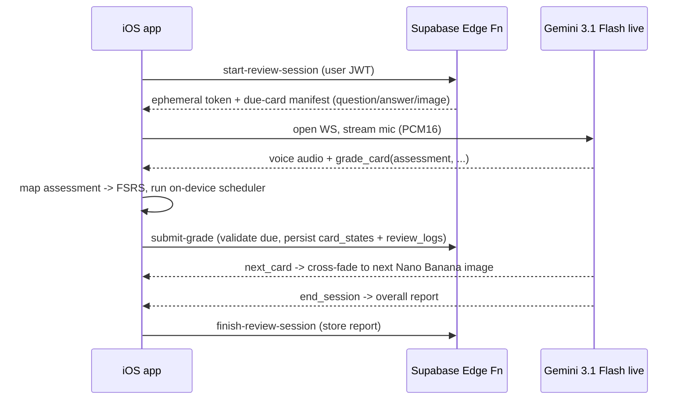

# RFC 001 — Live Voice Review Agent

**Status:** Draft
**Author:** (you)
**Created:** 2026-06-22
**Affects:** `aretay-ios`, `aretay-admin`, `aretay-backend`

---

## 1. Summary

Replace the pre-generated multiple-choice **question videos** with a **live voice
AI tutor** that conducts each spaced-repetition exercise as a real conversation.

Each review card shows a single **still image** (generated by **Nano Banana 2** /
`Gemini 3.1 Flash Image Preview`) as a calm visual backdrop. A voice agent (Google
**Gemini 3.1 Flash live preview**) talks the learner through every due card out
loud: it asks the question, listens to the spoken answer, judges it, explains when
needed, and lets the learner **interrupt at any time to ask their own questions**.
When the queue is exhausted, the agent wraps up and the session **auto-ends**.

The FSRS scheduler, `card_states`, and `review_logs` are unchanged in spirit — but
the *rating signal* now comes from the agent's judgment of a spoken answer instead
of a multiple-choice tap, and per-question Seedance videos are replaced by a single
cheap image (~$0.067 each).

---

## 2. Background — how review works today

Current behavior summarized here for grounding.

- A **session** is a TikTok-style vertical feed (`SessionView` / `SessionFeedView`).
  Each queue item is a full-screen page: a **segment video**, a **question page**,
  or a **level transition**.
- For each flashcard `question` under a segment, the admin pipeline produces a
  short (~4–6s) **question video** via Seedance, plus **6 alternate (wrong)
  answers** stored on the `cards` row (`metadata.production.alt_answers`).
- In the app, a `QuestionPageView` loops that clip behind a **4-option
  multiple-choice overlay** (correct answer + 3 of 6 alternates, shuffled).
  Narration plays once, then repeats are muted.
- The tap is graded right/wrong → **binary FSRS-5** on device → persisted
  immediately to `card_states` + `review_logs` (rating `3` = right, `1` = wrong).

**Cost reality today:** question videos are Seedance ~5s clips at roughly **$0.40
each**, plus an LLM call for the 6 alternate answers. For a 40-segment course with
4–6 questions per chapter, question videos are a meaningful slice of the
~$110/course budget — and the alternate-answer generation exists *only* to feed the
MC overlay.

---

## 3. Motivation

1. **Active recall > recognition.** Multiple choice is recognition; speaking the
   answer aloud is free recall, which is a stronger memory signal and a better
   match for the "Learn Anything / Become Extraordinary" promise.
2. **Conversational depth.** A learner who is confused can't ask a multiple-choice
   overlay anything. A live agent can re-explain, give a hint, or go on a tangent
   and come back.
3. **Production savings.** The agent conducting the review removes per-question
   Seedance clips and the 6-alternate-answer LLM step, replacing them with one cheap
   ~$0.067 Nano Banana 2 still (rendered from a stored, editable image prompt) —
   roughly a 3× cut on the question line, and a far faster pipeline (seconds vs.
   minutes). Grading needs no extra production: the agent judges the spoken answer
   against the question card's existing canonical answer.
4. **Differentiation.** "A tutor that quizzes you out loud while the lesson plays"
   is a stronger story than "another flashcard app."

---

## 4. Goals / Non-goals

### Goals
- A voice agent conducts all **due** spaced-repetition cards for a session,
  end-to-end, hands-free.
- The learner can **barge-in / interrupt** to ask questions and get answers.
- Each card produces a **flexible FSRS rating** (`Again`/`Hard`/`Good`/`Easy`,
  see §7.4 / §9) from the agent's judgment and persists to `card_states` +
  `review_logs` — incrementally, preserving today's no-loss guarantee.
- Each card shows a cheap **still image** (Nano Banana 2) as a calm backdrop.
- The session **auto-ends** and shows the existing summary screen.
- Graceful **fallback to the current MC overlay** when voice is unavailable
  (no mic permission, offline, API error, model region-blocked).

### Non-goals (this RFC)
- Changing FSRS math, the scheduler version, or the desired-retention model.
- Replacing the **teaching** experience (segment videos keep their narration when
  shown as new content; muting only applies during review).
- Building our own STT/TTS stack — we lean on the Gemini Live API's native audio.
- On-device LLM. The agent runs through the hosted Gemini Live API.

---

## 5. Proposed experience

### 5.1 The review block becomes a "Live Review"

When a session reaches its review cards (today: due reviews first, then
interleaved), instead of paging through individual MC question pages, the app
enters a **Live Review** mode:

1. A full-screen surface shows the current card's **still image** (Nano Banana 2,
   see §5.2) as a calm backdrop. No video, no captions — nothing on screen reveals
   the answer.
2. A persistent **voice UI** sits on top: a talk indicator (agent speaking /
   listening / thinking), a live transcript line, a mute/push-to-talk control, and
   the usual close (✕) + progress bar.
3. The agent **greets briefly**, then asks card 1's question aloud.
4. The learner **answers by voice**. The agent judges it, gives a one-line
   confirmation or correction, and moves on — or the learner **interrupts** with a
   question and the agent handles it before continuing.
5. When the agent advances (`next_card` / after `grade_card`), the surface
   **cross-fades to the next card's image**.
6. When the queue is clear, the agent gives a short wrap-up and the app shows the
   existing **`SessionSummaryView`**.

New segment videos that introduce content still play with **full audio** as today;
the still-image surface and voice agent apply specifically to the
**spaced-repetition review exercises**.

### 5.2 Why a still image (not video)

The review is now a *listening* experience, so the visual should be calm and
non-distracting — a busy narrative clip competes with the agent's voice for
attention. A single still per card is also dramatically cheaper and faster to
produce than the per-question Seedance clips it replaces:

- **Nano Banana 2** (`Gemini 3.1 Flash Image Preview`) at **~$0.067/image** vs.
  ~$0.40 for a 5s Seedance clip — and it renders in **seconds, not minutes**.
- Generated with the course's **board/cover as a style anchor** so review stills
  match the course's visual identity instead of looking random.
- Same vendor family as the voice model (Gemini), which keeps the stack coherent.

**Fallback ($0):** when an image is missing, or in MC fallback mode, reuse the
**parent segment's already-produced video (muted) or its board image** — no new
generation needed.

### 5.3 Interruptions

The Gemini Live API supports natural barge-in (the user can talk over the model and
it stops). The agent's system instructions tell it to: answer the tangent, then
gently steer back to the current card, and never reveal the answer to a card it
hasn't graded yet.

### 5.4 Auto-end

The agent ends when:
- the due/queued card list is exhausted, or
- the learner says they want to stop, or
- an inactivity timeout elapses with no speech.

On end, the client tears down the live session and presents the summary.

---

## 6. Architecture

### 6.1 High-level



The iOS app owns: `AVAudioEngine` (mic PCM16 ↔ speaker), the still-image surface
(Nano Banana 2, swapped on tool calls), the Live WebSocket client, and the
**tool-call handler → on-device FSRS → Supabase** bridge.

### 6.2 Where the live session is brokered — **decided: ephemeral token**

The device connects **directly** to the Gemini Live API using a short-TTL
**ephemeral token** minted by a Supabase Edge Function, so the long-lived API key
never ships in the app. This wins on latency (fewer hops) over proxying the
WebSocket through an edge relay, and avoids edge-runtime constraints around
long-lived sockets. (Proxy-through-relay remains the fallback if direct connections
prove unreliable.)

### 6.3 Audio pipeline (iOS)

- `AVAudioSession` configured for `.playAndRecord`, voice-chat mode, echo
  cancellation on (so the agent doesn't hear itself).
- Mic frames streamed as PCM16 to the Live API; model audio streamed back and
  played through the speaker.
- The visual surface is a **static image**, not a player — nothing on screen plays
  audio or reveals the answer. (The $0 fallback may show a muted segment video; in
  that case `player.isMuted = true` and captions stay off.)

### 6.4 The agent's context (per session)

The Edge Function (or app) builds a **system instruction + card manifest** for the
live session from existing data:

- Course title/subtitle for tone.
- The ordered list of **due cards** for this user/course, each with:
  - the `question` text,
  - the canonical `answer` the agent grades the spoken answer against,
  - optionally the source segment's `script` (for re-explanation) / key facts.
- Tutor rules (the **generic grader** — same for every card): ask one card at a
  time, compare the spoken answer to the canonical answer, accept
  paraphrases/synonyms as correct, be encouraging, allow interruptions, never read
  the answer before grading, call `grade_card` for every card, call `end_session`
  when done.

The canonical answers are sent to the **model**, not rendered on screen — the
learner only hears the question.

### 6.5 Tool calling (grading + persistence)

These tools are **Gemini Live function-calls handled on-device** — not Supabase RPCs.
The model emits a function-call event over the live WebSocket; the iOS client runs
the handler and (where needed) makes the Supabase write itself.

| Tool | When | Effect on client |
|---|---|---|
| `grade_card(card_id, assessment, fluency, hint_used, answer_transcript, rationale)` | After judging a spoken answer against the canonical answer (§9.1) | App maps `assessment` → FSRS Again/Hard/Good/Easy (§9.2), runs the on-device scheduler, upserts `card_states`, and posts `submit-grade` (writes `review_logs`). |
| `next_card()` | Ready to move on | App cross-fades to the next card's Nano Banana image. |
| `end_session(report)` | Queue exhausted / user quits | App posts `finish-review-session` (stores the report), tears down audio + WS, shows summary. |

Only the *source* of the rating changes (agent judgment vs. MC tap); the on-device
FSRS scheduler and the `card_states` / `review_logs` write path stay structurally the
same, gaining `session_id`, `source`, `assessment`, `answer_transcript`, and
`agent_rationale` (§7.3).

### 6.6 iOS code shape

- New `LiveReviewController` (`@Observable`, `@MainActor`) owning the audio engine,
  WS client, transcript state, tool-call handling, and the FSRS bridge. This is now
  **the grader** — `SessionEngine` no longer decides right/wrong; it becomes a
  **relay** that supplies the due queue and applies the rating the controller hands
  back.
- `SessionEngine` gains a branch: review items route to Live Review when enabled;
  segment-teaching items are untouched.
- New `LiveReviewPageView` replacing the stacked `QuestionPageView`s for the review
  block — a **still-image surface** (Nano Banana 2, cross-faded on tool calls) + the
  voice UI overlay.
- `SessionFeedPolicy` gets a `reviewMode: .multipleChoice | .liveVoice` knob so we
  can flag-flip and fall back.

---

## 7. Data model changes (`aretay-backend`)

This is the heart of the change. Moving from a synchronous, deterministic grader to
a deferred, **flexible** LLM grader breaks four properties of today's model and the
schema has to absorb them:

| Property today | What the voice/report model changes |
|---|---|
| Grading is **synchronous** (tap → FSRS → write) | Grading is **deferred** to the agent; an "answer" is a conversation turn, not an event |
| Rating is **binary & deterministic** (1/3) | Rating is **judged** — partial credit, paraphrase, confidence; no rigid right/wrong |
| Sessions are **ephemeral** client state | A report needs an owner → sessions become a **persisted entity** |
| Question = 3-word `answer` + 6 distractors | The grader judges a spoken paraphrase against the **canonical answer** — no distractors |

### 7.1 `cards` — the canonical answer is the grading signal

A question card stays minimal: its existing `question` + `answer` (from the
curriculum) are everything the grader needs. The agent compares the spoken answer to
the canonical `answer`, accepting paraphrases and synonyms — there is **no per-card
rubric**. Keeping grading generic (one instruction for all cards, §6.4/§9) is the
deliberate simplification: no rubric generation step, nothing extra to author or
store for grading.

The only generated artifact a question card gains is the **review still** and the
prompt used to render it, stored alongside existing artifacts (boards / `alt_answers`
live the same way):

```jsonc
{
  "review_image_prompt": "the editable prompt the still was rendered from",
  "review_image_r2_key": "…/segments/{questionKey}-review.png"
}
```

`alt_answers` becomes **legacy — retained only for the MC fallback path**. The admin
pipeline drops the 6-alternate-answer step entirely; nothing replaces it on the
grading side.

### 7.2 `review_sessions` — new (the report needs a home)

No session row exists today. The agent's end-of-session report is session-scoped:

```sql
create table review_sessions (
  id           uuid primary key default gen_random_uuid(),
  user_id      uuid not null,                  -- RLS owner
  course_id    uuid,                            -- null if cross-course review feed
  mode         text not null,                   -- 'voice' | 'mc'
  scheduler    text not null,                   -- fsrs version stamp used
  status       text not null default 'active',  -- 'active'|'completed'|'abandoned'
  started_at   timestamptz not null default now(),
  ended_at     timestamptz,
  card_count   int default 0,
  report       jsonb                            -- { overall, strengths[], weaknesses[], focus_next[] }
);
```

### 7.3 `review_logs` — extend, don't replace

Already the append-only history that card state replays from — the right place for
per-card grades. Add:

```sql
alter table review_logs
  add column session_id        uuid references review_sessions(id),
  add column source            text default 'mc',  -- 'mc' | 'voice'
  add column answer_transcript text,               -- what the learner actually said
  add column assessment        text,               -- 'correct'|'partial'|'incorrect'|'skipped'
  add column agent_rationale   text;               -- why it graded that way
```

The agent emits a **semantic `assessment`**, *not* a raw FSRS number — we keep the
`assessment → FSRS rating` mapping in our code so the model's job stays semantic and
the scheduler stays in our control. `rating` is still stored, derived from
`assessment`.

### 7.4 `card_states` — graduate the scheduler stamp

The flexible grade is the reason to move **off `fsrs5-binary`**: once the agent can
distinguish partial / hesitant / confident, we can emit the full
**Again/Hard/Good/Easy** scale instead of 1/3. New `scheduler` version (`fsrs5`).
Because everything replays from `review_logs`, existing binary history stays valid.

### 7.5 Persistence timing — **hybrid** (recommended default)

The "report at the end" collides with today's guarantee that *quitting mid-session
loses nothing*, which matters more here because per-minute voice sessions are
exactly where disconnects happen. Resolution:

- The agent calls **`grade_card` incrementally** as it finishes each card → writes a
  `review_logs` row + updates `card_states` right then (no-loss preserved).
- The **end report** is the qualitative wrap-up stored on `review_sessions.report`.

This also keeps **FSRS on-device** per incremental grade (least change); the Edge
Function only validates + stores. (Pure end-only reporting would push FSRS
server-side — see §14.)

### 7.6 Trust boundary — new

The grade now originates from an LLM the **client** is talking to, so a malicious
client could submit "all correct." New Edge Functions, all auth'd by the user JWT
and RLS-respecting:

- `mint-live-token` / `start-review-session`: creates the `review_sessions` row,
  builds the due-card manifest + system instruction, returns an **ephemeral Gemini
  Live token** + session config (never the long-lived key).
- `submit-grade` (incremental) / `finish-review-session`: **validates** that graded
  cards were actually **due** for that user, ratings in range, then persists.

`GEMINI_API_KEY` and the model id (e.g. `gemini-3.1-flash-live-preview`) stay as
backend secrets, never in the iOS bundle.

### 7.7 `course_enrollments` (optional)

Add `review_mode text` (`'voice'`/`'mc'`) per-user for staged rollout, or gate
purely client-side via flag.

---

## 8. Production-pipeline impact (`aretay-admin`)

This is the biggest cost win, and it's mostly *subtractive*. Today the per-question
pipeline (`generate-question-video`) does four expensive things — Kokoro audio →
6 alternate answers → video prompt → Seedance clip. In the new model a question card
needs only **one still image** (its question + answer already live in the
curriculum). The change is concrete and file-scoped:

### 8.1 `generate-question-video/route.ts` → `generate-review-asset`

`aretay-admin/app/api/generate-question-video/route.ts` collapses from a ~200-line
4-stage pipeline to two calls: write an **editable image prompt** from the question
(text LLM), then render **one Nano Banana 2 still** from it. Drop the **audio**
(Kokoro), **alternate-answer**, **video prompt**, and **Seedance** stages entirely.
Rename the route to `generate-review-asset`.

### 8.2 `lib/production.ts`

- Add `review_image_prompt` and `review_image_r2_key` to `ProductionData`
  (`aretay-admin/lib/production.ts`). No `grading` field — there is no rubric.
- Keep `alt_answers` as **legacy** (MC fallback only).
- Remove `buildAltAnswersPrompt` from the question path; add the review-image prompt
  builder. Remove `MIN_QUESTION_VIDEO_SECONDS`, `buildQuestionVideoPromptPrompt`, and
  the question-video Seedance cost usage.

### 8.3 Image generation via OpenRouter

Reuse the existing `generateImage` path in `aretay-admin/lib/llm.ts` (today
`IMAGE_MODEL = "openai/gpt-5.4-image-2"`, called from
`aretay-admin/app/api/generate-board/route.ts`). Add a Nano Banana model id
(e.g. `google/gemini-3.1-flash-image-preview`) and extend `generateImage` to accept
a **reference image** (the parent segment's board or the course cover) so review
stills inherit the course's visual style. Cost ~$0.067/image.

### 8.4 `lib/bulk-job.ts`

- `produceQuestion` (`aretay-admin/lib/bulk-job.ts`) calls the new route — no
  Seedance retry loop needed (the prompt + image calls are cheap and fast).
- `buildPlan`'s question filter changes from `!cards.get(q.questionKey)?.video_r2_key`
  to "needs a review image" (`!...review_image_r2_key`).

### 8.5 Studio UI (`app/courses/[id]/page.tsx`)

- Question cards drop the video stage bar / video preview / caption row. They show
  the question → answer, the **review image preview**, and the **editable image
  prompt** (tweak it and re-render the still).
- *(Phase 2)* a **"test grade" sandbox**: type a sample spoken answer and see how the
  agent would assess it against the canonical answer — the manual side of the §9.5
  calibration loop.
- The **Generate-all confirmation popup** drops the "question videos (~$0.40 each)"
  line and changes "alternate answers (~$0.05)" to "review image + image prompt
  (~$0.067 + ~$0.01)."

### 8.6 Net effect

Per question you **remove** a Seedance ~5s clip (~$0.40), the Kokoro narration, the
6-alternate-answer LLM call, and the Whisper caption pass, and **add** one ~$0.067
image (plus a ~$0.01 image-prompt LLM call). Grading adds **nothing** to production.
Segment (teaching) video production is **completely unchanged** — muting/visual
choices are client-side. For a ~50-question course that's roughly **$20 → ~$4** on
the question line, before lazy generation reduces volume further.

---

## 9. Grading semantics

Core principle: **the agent makes a semantic judgment; our code owns the math.** The
LLM never picks an FSRS number — it describes what happened, and a deterministic
table converts that into a rating. This keeps grading fair, tunable, and replayable
from `review_logs` under a scheduler version.

### 9.1 What the agent emits per card

Every `grade_card` tool call returns a structured judgment, not a score:

```jsonc
grade_card({
  card_id,
  assessment:     "correct" | "partial" | "incorrect" | "skipped",
  fluency:        "fluent" | "hesitant",   // how it came out — heard, not timed
  hint_used:      true | false,            // did the agent nudge before they got it?
  answer_transcript: "what they actually said",
  rationale:      "one line on why"        // → review_logs.agent_rationale
})
```

`assessment` is judged by comparing the spoken answer to the card's **canonical
answer**, accepting paraphrases and synonyms (meaning, not exact wording): fully
conveys it → `correct`, partially → `partial`, wrong → `incorrect`, silence/no-answer
→ `skipped`.

### 9.2 The deterministic mapping → FSRS

Our code (not the prompt) maps the judgment to **Again/Hard/Good/Easy** (`fsrs5`,
§7.4). The intuition is two axes — *correctness* and *effort* — exactly what FSRS's
four grades encode:

| assessment | hint_used | fluency | → FSRS rating |
|---|---|---|---|
| `incorrect` / `skipped` | – | – | **Again (1)** |
| `partial` | – | – | **Hard (2)** |
| `correct` | yes | – | **Hard (2)** — got there, but needed help |
| `correct` | no | hesitant | **Good (3)** |
| `correct` | no | fluent | **Easy (4)** |

Because we log the raw `assessment`, ratings can be re-derived under a future mapping
without losing history.

### 9.3 Integrity rules (in the system instruction)

The soft spot in any LLM grader is gaming, so the prompt enforces:

- **Grade before reveal.** The agent must call `grade_card` *before* it ever says the
  answer. "I don't know, what is it?" → `skipped` → Again, *then* it explains.
- **Hints downgrade, they don't rescue.** Any nudge caps the card at Hard; a full
  reveal makes it Again.
- **One grade per presentation.** Wrong-then-corrected-after-a-hint within the same
  card is a single Hard — a genuine second shot only comes via the relearning
  requeue (~10 min later), graded fresh.
- **No self-grading.** The learner can't say "mark it right"; the agent grades what
  was actually said. (The server validates the card was *due*, but truthfulness rests
  on the agent's judgment — a known limitation, §11.)
- **Tangents aren't graded.** Interruptions to ask questions are answered, not scored;
  only the answer *to the card* is graded.

### 9.4 Disputes & requeue

- **Disputes:** if the learner says "that's wrong, I said X," the agent re-grades by
  emitting a corrected `grade_card`. The client treats the latest grade for a card as
  authoritative and logs both (with `agent_rationale`).
- Wrong/partial answers still **requeue** in-session per the FSRS relearning rule.

### 9.5 Calibration

Because grading is now probabilistic, Phase 2 logs every `assessment` + `transcript`
+ `rationale` and spot-checks a sample against a stronger offline grader to tune
(a) the generic grading instruction (§6.4/§9.3) and (b) the mapping table. If the
agent is systematically too generous on `partial`, we tighten the instruction or
shift `partial` → Again — all without touching FSRS. The studio "test grade" sandbox
(§8) is the manual side of this loop.

---

## 10. Latency, cost, reliability

- **Latency:** Live API targets sub-second audio response; barge-in is native.
  Target end-to-end "learner stops talking → agent starts" under ~1s. Needs
  measurement on cellular.
- **Cost model (new):** cost shifts from **one-time production** to two places:
  - *Production* drops sharply — per question, ~$0.40 Seedance + Kokoro + Whisper is
    replaced by a single **~$0.067 Nano Banana 2 image** (+ a ~$0.01 image-prompt
    call); grading adds nothing (§8).
    Cheaper image alternates exist if needed: **Seedream 4.0 (~$0.03)** or
    **MAI-Image-2.5-Flash (~$0.02)**, at slightly lower quality — fine for ambient
    B-roll.
  - *Runtime* is new: Gemini Live bills on **audio input/output tokens + session
    time**. Heavy reviewers now cost per use, so we must estimate per-review-minute
    cost and add a **per-session budget/cap** (degrade to MC when hit).
- **Reliability/fallback:** if mic denied, offline, WS fails, token mint fails, or
  region-blocked → fall back to today's **MC overlay** seamlessly (which is why we
  keep `alt_answers` for at least the fallback path initially).
- **Privacy:** we're streaming the user's voice to a third party. Need mic
  permission copy, a privacy disclosure, and a decision on whether transcripts are
  stored (`review_logs.answer_transcript`) — likely opt-in or truncated.

---

## 11. Risks & open questions

1. **Model availability/naming.** Confirm `gemini-3.1-flash-live-preview` (voice)
   and `gemini-3.1-flash-image-preview` / Nano Banana 2 (images) exist, their API
   surfaces, supported audio formats, pricing, and regions. (Preview models can
   change/withdraw — keep both model ids config values.)
2. **Grading trust.** Will learners accept an LLM judging their spoken answer? Need
   a "I think that's right too" recovery path (re-grade tool).
3. **Runtime cost at scale.** Per-minute voice billing vs. one-time video. Could be
   cheaper *or* more expensive depending on session length and frequency — must
   model before committing to dropping question videos for everyone.
4. **Noisy environments / accents / ASR errors** degrading grading quality.
5. **Connection brokering:** ephemeral token (A) vs. proxy (B) — security vs.
   latency vs. observability.
6. **Image quality/consistency.** Nano Banana 2 stills must look coherent with the
   course style (board/cover reference) and never leak the answer — needs review in
   the studio (editable + regenerable).
7. **Accessibility:** voice-only excludes some users — MC fallback must be a
   first-class, user-selectable mode, not just an error path.
8. **App Store / review:** real-time AI voice + mic streaming may need extra
   privacy review and clear disclosure.

---

## 12. Rollout plan

### Phase 0 — Spike (de-risk the unknowns)
Bare iOS prototype, no real data. Goal: prove the live loop works and measure it.
- Connect to Gemini 3.1 Flash live, stream mic PCM16, hear it ask 2–3 **hardcoded**
  questions; confirm barge-in and a `grade_card` round-trip on-device.
- Confirm the API surface, audio formats, pricing, and regions for both
  `gemini-3.1-flash-live-preview` and Nano Banana 2 (§11.1).
- Measure end-to-end latency + token/session cost on a real device over cellular.
- Touchpoints: throwaway `LiveReviewController` spike; no backend, no schema.

### Phase 1 — Wire to real data (behind a per-user flag)
- **Backend:** migration for `review_sessions` + `review_logs` columns (§7.2/§7.3);
  Edge Functions `start-review-session` (mints ephemeral token + builds manifest)
  and `submit-grade` / `finish-review-session` (validate due + persist).
- **iOS:** `LiveReviewController` + `LiveReviewPageView`, `SessionEngine` review
  branch + `SessionFeedPolicy.reviewMode`, on-device `assessment → fsrs5` mapping
  (§9.2). Files: `aretay-ios/Aretay/Features/Session/SessionView.swift` (+ new files).
- **Admin:** `generate-review-asset` route (image prompt + Nano Banana image),
  `production.ts` + `bulk-job.ts` + studio `page.tsx` changes (§8). Produce review
  images for one test course.

### Phase 2 — Fallback + polish
- Robust **MC fallback** (mic denied / offline / WS or token failure / region-blocked).
- Transcript logging (`source` / `answer_transcript`) + the studio "test grade"
  sandbox; begin the §9.5 calibration loop.
- Interruption tuning, voice-UI states, per-session cost cap → degrade to MC.

### Phase 3 — Production savings
- New courses **skip question-video generation** by default (review image only);
  `alt_answers` only when MC fallback is enabled. Update the `generate-all` cost
  estimate. Measure grading quality vs. MC on the calibration set.

### Phase 4 — Default + measure
- A/B **voice vs. MC** on retention and session length; flip the default if it wins.

---

## 13. Alternatives considered

- **Keep MC, add an optional "explain" voice button.** Cheaper to build, but keeps
  recognition-based recall and doesn't unlock production savings.
- **TTS-only narration of questions (no live, no listening).** Loses the interrupt /
  free-recall value — it's just the current video narration without the clip.
- **On-device STT + our own LLM grading.** More control/privacy, far more
  engineering, worse conversational quality than a native live model.
- **Render question videos that *contain* the agent.** Defeats the interactivity;
  back to static media.
- **Per-item silent video instead of a still image.** No cost advantage — Seedance
  bills per output second regardless of audio (~$0.40 for 5s vs. ~$0.067 for a
  Nano Banana image), and it's minutes-slow to generate. Rejected for review visuals.

### Adjacent cost lever (not this RFC): Grok video for *segment* videos

`grok-imagine` video claims **$0.05/output-second** — ~37% under Seedance's $0.08/s
($0.75 vs $1.20 per 15s segment), which would cut the **dominant** course cost
(teaching videos). It's irrelevant to review visuals (still images already win), and
adopting it is gated on confirming Grok video supports **`reference_audios`**
(narration sync — a dealbreaker if absent) and **`reference_images`** (the board).
Flagged here as a future spike, separate from this RFC.

---

## 14. Decisions

### Resolved
- [x] **Visual: per-item still image via Nano Banana 2** (`Gemini 3.1 Flash Image
  Preview`, ~$0.067), style-anchored to the course board/cover; reuse of the muted
  segment video/board is the $0 fallback. (§5.2, §8)
- [x] **Persistence: hybrid** — incremental `grade_card` writes + end-of-session
  report. (§7.5)
- [x] **Rating: 4-grade `fsrs5`** (Again/Hard/Good/Easy). (§7.4, §9.2)
- [x] **FSRS location: on-device** per incremental grade. (§7.5)
- [x] **Connection: ephemeral token**, direct device → Gemini Live. (§6.2)
- [x] **Grading: generic, no per-card rubric.** A question card is just
  question + answer + a review image; the agent grades the spoken answer against the
  canonical answer with one shared instruction. (§6.4, §7.1, §9)

### Still open before Phase 1
- [ ] Keep generating `alt_answers` for the MC fallback, or drop for new courses?
- [ ] Store spoken transcripts (`answer_transcript`)? Opt-in vs. always vs. never.
- [ ] Per-session cost cap + behavior when hit (downgrade to MC?).
- [ ] Confirm Gemini 3.1 Flash live preview + Nano Banana 2 APIs, pricing, regions.

### Deferred (future work, not in this RFC)
- **Lazy / on-demand section generation.** For launch, the admin manually produces
  only the **first section(s)** of each course; the rest is generated later. Building
  automatic on-demand, usage-triggered section generation (hosted generation worker +
  jobs/lock table + hosted captioning) is a separate effort — likely its own RFC.
- **Grok video for segment production** as a ~37% cost lever (§13), gated on
  reference-audio/image support.
